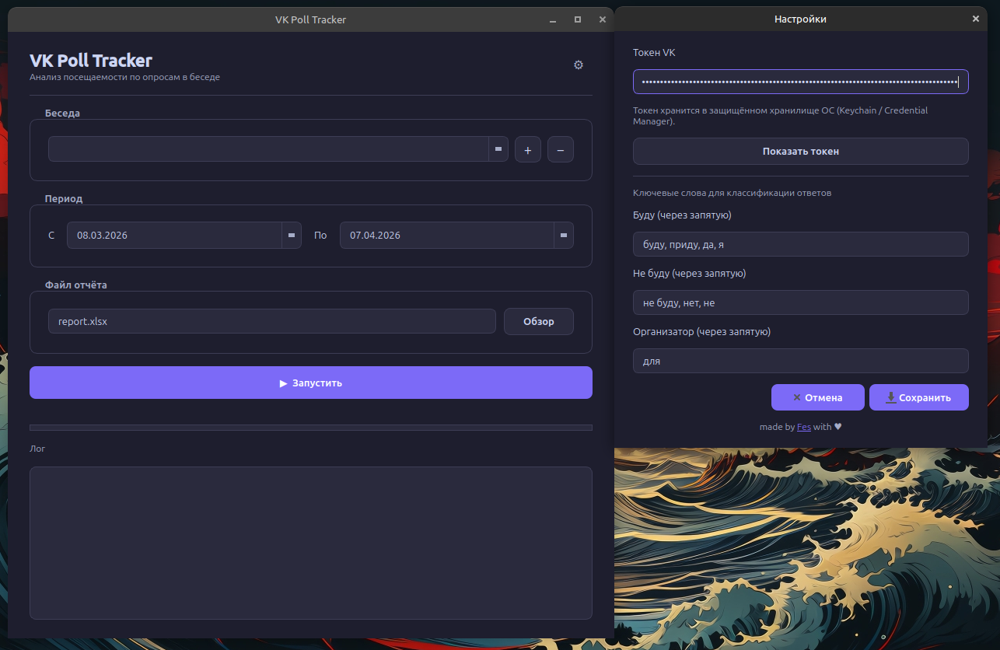
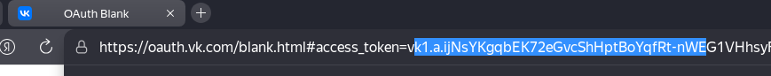

# VK Poll Tracker

Десктопное приложение для анализа посещаемости тренировок через опросы в беседах VK. Парсит опросы за нужный период, определяет кто сказал «буду», кто «не буду», кто вообще не ответил — и выгружает всё это в красивый Excel-отчёт.


---

## 🗒️ Инструкция для пользователей

### 1. Готовый бинарник
Скачайте последний релиз со страницы [Releases](https://github.com/Hr0mE/vk-poll-tracker/releases) под вашу платформу и запустите — всё уже внутри, Python устанавливать не нужно. Для работы требуется только получить токен (подтверждение, что можно производить сбор опросников с вашего аккаунта). 

### 2. Получение токена VK
1. Зайдите на [vkhost.github.io](https://vkhost.github.io/)
2. Выберите **VK Admin** (или любое приложение с доступом к сообщениям)
3. Нажмите **Получить** и разрешите доступ
4. Скопируйте `access_token` из адресной строки — он будет между `access_token=` и `&expires_in`

5. Вставьте токен в настройках приложения (кнопка ⚙ в правом верхнем углу)

> Токен хранится в защищённом хранилище ОС (Keychain на macOS, Credential Manager на Windows, libsecret на Linux) — нигде в файлах не лежит.

### 3. Как узнать Peer ID беседы
Peer ID групповой беседы = `2000000000 + локальный номер беседы`.

Peer ID найти можно в URL при открытии беседы через браузер:
`https://vk.com/im/convo/<число>`

### Запуск
1. Откройте приложение
2. Нажмите ⚙ → вставьте токен → сохраните
3. Добавьте беседу через кнопку **+** рядом с выпадающим списком
4. Выберите период и путь к отчёту
5. Нажмите **▶ Запустить**

### Результат
Файл `report.xlsx` (можно поменять название) с двумя листами:

**Матрица** — кто и на какой тренировке:

| Участник | 01.04 | 05.04 | 12.04 |
|---|---|---|---|
| Иван Иванов | + | + | - |
| Мария Петрова | - | / | + |
| Алексей Смирнов | орг | + | / |
| **Придут** | **2** | **2** | **1** |
| **Не придут** | **1** | **0** | **1** |
| **Не ответили** | **0** | **1** | **1** |

**Сводка** — статистика по каждому участнику за весь период.

Обозначения: `+` был, `-` не был, `/` не ответил, `орг` организатор, `н/д` нет доступа к опросу.

---

## 🛠️ Инструкция для разработчиков

Клонируйте репозиторий и установите зависимости:
```bash
git clone https://github.com/Hr0mE/vk-poll-tracker.git
cd vk-poll-tracker
python -m venv .venv
source .venv/bin/activate  # Windows: .venv\Scripts\activate
pip install -r requirements.txt
```

Создайте `.env` (нужен только для CLI-режима, GUI берёт токен из keyring):
```bash
cp .env.example .env
# отредактируйте .env: впишите VK_TOKEN и PEER_ID
```

Запуск GUI:
```bash
python -m app.gui
```

Запуск CLI (без интерфейса):
```bash
python -m app.main --date-from 2026-04-01 --date-to 2026-04-30 --output report.xlsx
```

### Сборка бинарника
```bash
pip install pyinstaller
pyinstaller --onefile --windowed --name "VK Poll Tracker" \
  --collect-all pydantic_settings \
  --hidden-import "keyring.backends" \
  app/gui.py
```

Готовый файл появится в `dist/`.

### GitHub Actions
Пуш тега автоматически собирает бинарники под Linux, Windows и macOS и создаёт релиз:
```bash
git tag v1.0.0
git push origin v1.0.0
```

---

## 📁 Файловая структура

```
vk-poll-tracker/
├── app/
│   ├── main.py              -- CLI точка входа
│   ├── gui.py               -- десктопный интерфейс (PyQt6)
│   ├── config.py            -- настройки через pydantic-settings / .env
│   ├── keywords.py          -- хранение ключевых слов для классификации
│   │
│   ├── vk/
│   │   ├── client.py        -- async VK-клиент с retry и backoff
│   │   ├── rate_limiter.py  -- token bucket + semaphore
│   │   └── methods.py       -- обёртки над методами VK API
│   │
│   ├── services/
│   │   ├── poll_service.py      -- сбор опросов из истории беседы
│   │   ├── user_service.py      -- участники, голоса, классификация
│   │   └── analytics_service.py -- агрегация статистики
│   │
│   ├── models/
│   │   ├── poll.py          -- Poll, PollAnswer
│   │   ├── user.py          -- User
│   │   └── record.py        -- Record, VoteStatus
│   │
│   └── exporters/
│       └── excel_exporter.py -- экспорт в .xlsx (две вкладки)
│
├── .github/workflows/
│   └── build.yml            -- сборка под Linux / Windows / macOS
├── .env.example
└── requirements.txt
```

---

## 📚 Стек

- 🖥️ **Интерфейс**
  - PyQt6 — десктопный GUI с тёмной темой
  - keyring — безопасное хранение токена в системном keychain
- 🌐 **Сеть**
  - httpx — асинхронные HTTP-запросы к VK API
  - asyncio — параллельная обработка опросов
- 📊 **Данные**
  - pandas + openpyxl — формирование Excel-отчёта
  - pydantic-settings — конфигурация через .env
- ⚙️ **Сборка**
  - PyInstaller — упаковка в один бинарник
  - GitHub Actions — автоматическая кросс-платформенная сборка